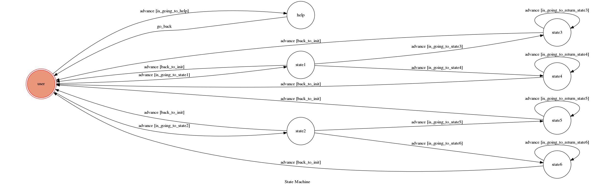
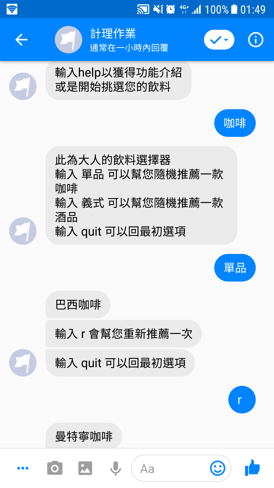
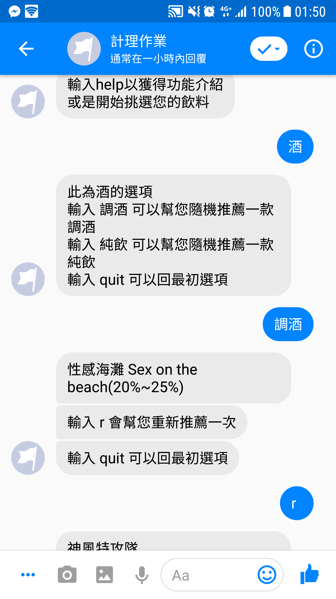
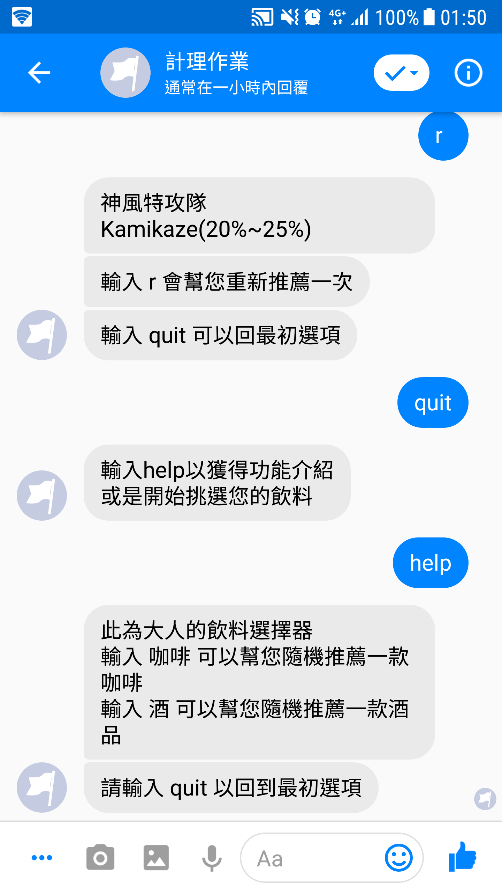

# TOC Project 2019

Template Code for TOC Project 2019

A Facebook messenger bot based on a finite state machine

More details in the [Slides](https://hackmd.io/p/SkpBR-Yam#/) and [FAQ](https://hackmd.io/s/B1Xw7E8kN)

## Setup

### Prerequisite
* Python 3
* Facebook Page and App
* HTTPS Server

#### Install Dependency
```sh
pip3 install -r requirements.txt
```

* pygraphviz (For visualizing Finite State Machine)
    * [Setup pygraphviz on Ubuntu](http://www.jianshu.com/p/a3da7ecc5303)

#### Secret Data

`VERIFY_TOKEN` and `ACCESS_TOKEN` **MUST** be set to proper values.
Otherwise, you might not be able to run your code.

#### Run Locally
You can either setup https server or using `ngrok` as a proxy.

**`ngrok` would be used in the following instruction**

```sh
./ngrok http 5000
```

After that, `ngrok` would generate a https URL.

#### Run the sever

```sh
python3 app.py
```

## Finite State Machine


## Usage and Command
* state 說明

	* 起始 state 為 `user`.
	* 輸入"咖啡" 
		+ 進入 `state1`  
	* 輸入"酒" 
		+ 進入 `state2`
	* 輸入"help"
		+ 進入`help` state 
		+ 要輸入"quit"才會回到user state
    * 在 state1 
       * 輸入"單品"
                + 進入`state3`
       * 輸入"義式"
                + 進入`state4`            
	* 在 state2
       * 輸入"調酒"
                + 進入`state5`
       * 輸入"純飲"
                + 進入`state6` 
       * 在 state3 state4 state5 state6
          輸入"r"，會重新到自己本身的state
       *除了user state 其他states中 
          輸入"quit"，會回到user

* 功能1:隨機推薦一款咖啡

	* 輸入 "咖啡" 開始選擇
	* 再選擇要喝的是"單品咖啡"還是"義式調飲"
	* 選擇完會隨機推薦一款咖啡
	* 不喜歡該推薦可按"r"重新推薦

	

* 功能2:隨機推薦一款酒

	* 輸入 "酒" 開始選擇
	* 再選擇要喝的是"調酒"還是"純飲"
	* 選擇完會隨機推薦一款酒種
	* 不喜歡該推薦可按"r"重新推薦


* 功能3:

	* 輸入: "help" 可查看bot的說明
	

## Author
[胡運瑜](https://github.com/huyunyu10)
